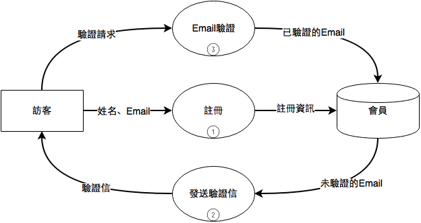
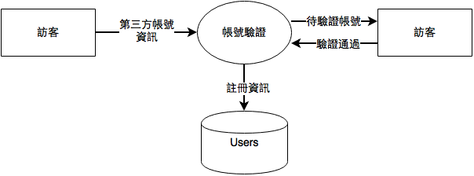
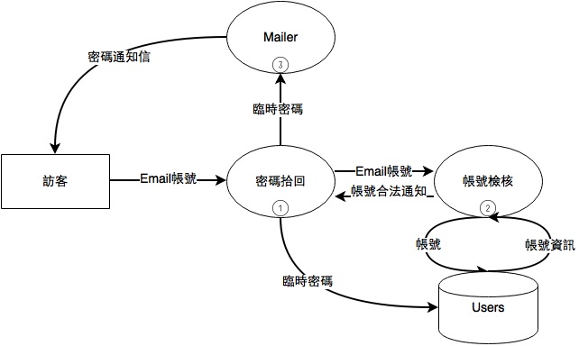

[](https://codeclimate.com/github/fruitcake0525/ror_taichung)
[](https://codeclimate.com/github/fruitcake0525/ror_taichung/issues)
[](https://waffle.io/fruitcake0525/ror_taichung)
== 說明文件
# RoR Taichung 官網

## Getting Started
```
$ git clone https://github.com/fruitcake0525/ror_taichung
$ cd ror_taichung
$ bundle install
$ bundle exec figaro install
$ rake db:migrate
$ rake db:seed
```
* figaro applcation.yml 請 [Slack]( https://rortc.herokuapp.com/) 私訊取得

## 前言
RoR Taichung 官網是Rails Taichung為了Rails在台中持續發展深耕並服務社群所建立。本專案也是Rails Taichung第一個團隊開發專案。
* 開發工具為Ruby on Rails
* 專案管理方式以敏捷開發為主，以Trello做為專案管理工具。

## User Stories
### 用戶註冊/登入
1. 訪客可以在前台註冊成社群成員
  1. 訪客可以在前台用Google+、FB、Github帳號註冊
  2. 訪客可以用Email註冊
    3. 訪客可以在自己的信箱收到Email驗證信
2. 訪客可以在前台登入成社群成員
  1. 訪客可以在前台用Google+、FB、Github帳號直接登入
  2. 訪客可以用Email/密碼登入
3. 訪客可以在前台使用密碼拾回功能
  1. 訪客可以在密碼拾回頁面輸入Email帳號
  2. 訪客可以在自己的信箱收到密碼變更連結信件

### 活動(專案)資訊
1. 過去/未來活動(專案)
    1. 訪客可以在前台看到所有活動清單
2. 活動(專案)查詢
    1. 訪客可以在前台用關鍵字查詢活動
3. 活動(專案)登錄
    1. 社群成員可以在前臺登錄活動/專案的Landing Page
        1. 社群成員可以在前臺登錄活動/專案時可以決定類型
        2. 社群成員可以在前臺維護活動/專案名稱
        3. 社群成員可以在後台使用編輯工具編輯活動/專案內容與訴求
        4. 社群成員在後台建立活動/專案後預設為活動/專案管理員
        5. 管理員在社群成員建立活動/專案後，可以在後臺核准是否可以發佈。
4. 活動(專案)登記參加
    1. 社群成員可以對活動登記參加、退出及有興趣
5. 活動(專案)提醒通知
    1. 參與活動的社群成員在活動前一天可以收到Email通知
    2. 有參加專案或有興趣的社群成員可以收到專案進度的Email通知

### 技術筆記
1. 問題看板
    1. 尋求協助
        1. 社群成員在前台可以登錄問題
        2. 社群成員在前台可以上傳問題圖片
    2. 問題回覆
        1. 社群成員可以在前臺回覆其他成員的問題
        2. 社群成員在回覆問題時可以標註Code
        3. 只要是參與問題的社群成員都可以收到問題回覆信件提醒
        4. 提問的社群成員可以在前台標註問題是否解決
        5. 管理員可以在前台標註問題是否解決
2. 好資料分享
    1. 資源分類
        1. 管理員可以在後台針對資源進行tag分類
    2. 資源登錄
        1. 社群成員可以在前台分享新資源
        2. 所有社群成員都可以在前台檢視所有的資源
        3. 所有社群成員可以在前台對該資源發表評論
        4. 管理員可以在後台刪除過期/失效的資源
    3. 資源查詢
        1. 所有人都可以在前台查詢資源
            1. 所有人都可以在前台透過資源類型與關鍵字查詢資源

### 社群資訊
1. 社群介紹 group info
  1. 主題/精神文案
    1. 直接寫成靜態網頁
  2. Slack/ Facebook 資源
    1. 直接寫成靜態網頁
    2. Slack邀請自己
2. 成員介紹 user
  1. Blog/臉書/Github連結
    1. 社群成員可以在後台自由的維護自己的相關資訊
  2. 個人參與
    1. 社群成員可以在後臺檢視自己曾參與過的社群專案
    2. 社群成員可以在後臺檢視自己提出的社群問題
    3. 社群成員可以在後臺檢視自己回覆的社群問題
  3. 魅力大頭貼
    1. 社群成員在用FB/Google註冊後就可以顯示FB/Google的大頭貼。
    2. 社群成員可以自己上傳照片當作大頭貼
    3. 社群成員可以選用Gavatar當作大頭貼

## 系統分析
### Data Flow Diagrams
#### 用戶註冊/登入
##### Email註冊流程

##### 第三方認証

##### 密碼拾回

